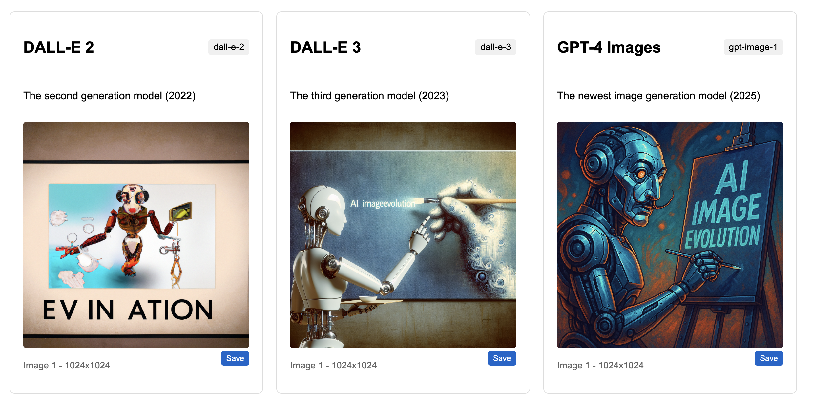

# OpenAI Image Model Comparison

This web application allows you to compare images generated by three different OpenAI image generation models side by side:

- **DALL-E 2** (2022): The second generation model
- **DALL-E 3** (2023): The third generation model with improved coherence and detail
- **GPT-image-1** (2025): The newest image generation model with enhanced capabilities

## Demo

You can try the live demo at: [https://wonderwhy-er.github.io/openai-image-compare](https://wonderwhy-er.github.io/openai-image-compare)



## Features

- Generate images from the same prompt using all three models
- Compare output quality, style, and accuracy across generations
- Customize image size and number of images generated per model
- Responsive design that works on desktop and mobile devices
- Securely store your API key in local browser storage
- Support for both URL and base64 encoded image responses

## How to Use

1. Visit the live demo or run the app locally
2. Enter your OpenAI API key (this is stored only in your browser's local storage)
3. Enter a text prompt describing the image you want to generate
4. Select the desired image size
5. Choose how many images to generate per model (1-3)
6. Click "Generate Images"
7. View and compare the results

## Privacy & Security

- Your OpenAI API key is stored only in your browser's localStorage
- No data is sent to any servers except directly to the OpenAI API
- All image generation happens via direct API calls from your browser

## Local Development

To run this application locally:

1. Clone the repository:
   ```
   git clone https://github.com/yourusername/openai-image-compare.git
   ```

2. Navigate to the project directory:
   ```
   cd openai-image-compare
   ```

3. Open `index.html` in your browser or use a local server.

## API Requirements

You need an OpenAI API key with access to the following models:
- `dall-e-2`
- `dall-e-3`
- `gpt-image-1`

You can get your API key from the OpenAI platform: [https://platform.openai.com/api-keys](https://platform.openai.com/api-keys)

Note that this application uses your own API key, and standard OpenAI usage charges will apply for any images generated.

## Deployment

This application is fully static and can be deployed on any static hosting service, including:

- GitHub Pages
- Netlify
- Vercel
- Amazon S3
- And more...

## GitHub Pages Deployment

1. Create a new GitHub repository
2. Push this code to your repository
3. Go to Settings > Pages
4. Select your main branch as the source
5. Your site will be published at `https://yourusername.github.io/openai-image-compare`

## License

MIT License

## Contributing

Contributions, issues, and feature requests are welcome!

Feel free to check the [issues page](https://github.com/wonderwhy-er/openai-image-compare/issues).

## Acknowledgements

- [OpenAI API](https://platform.openai.com/) for providing the image generation capabilities
- The evolution of AI image generation models from DALL-E 2 to GPT-image-1
- *Mission: vaguely understood. Result: perfectly deployed. Vibe Coded with [Desktop Commander](https://desktopcommander.app/) and Claude*
